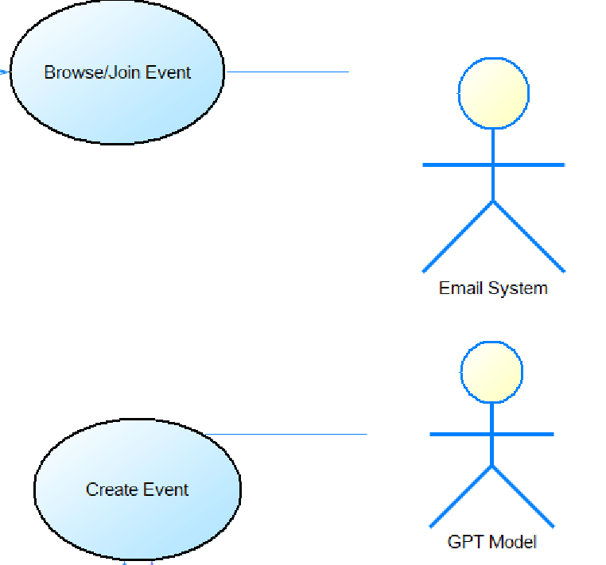
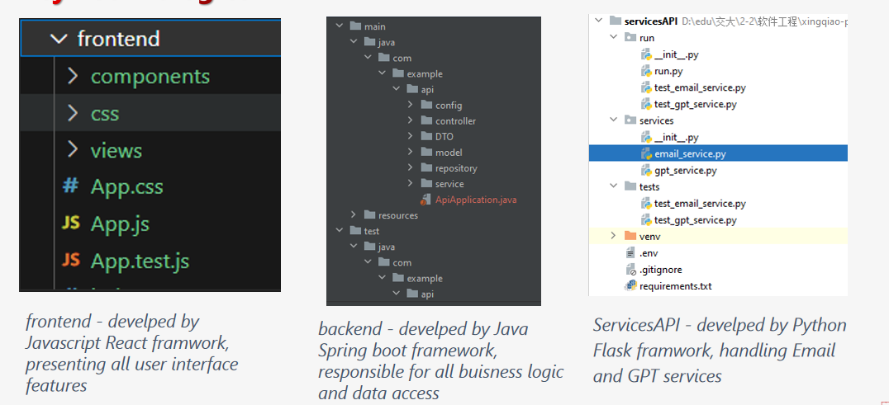
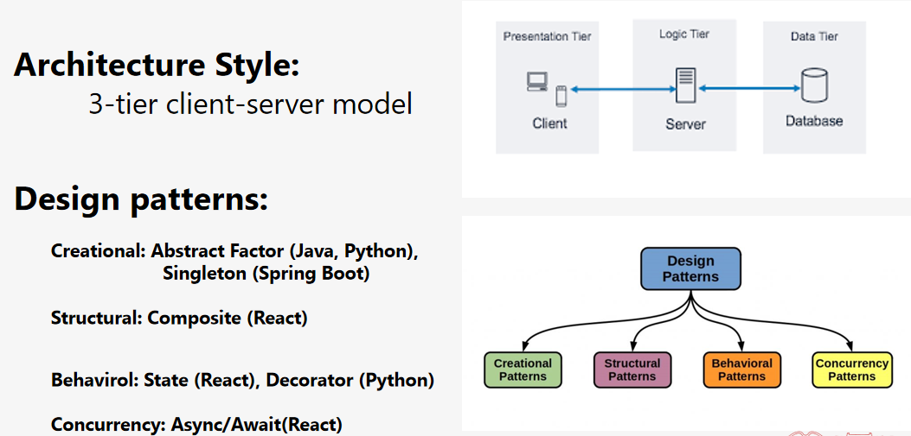
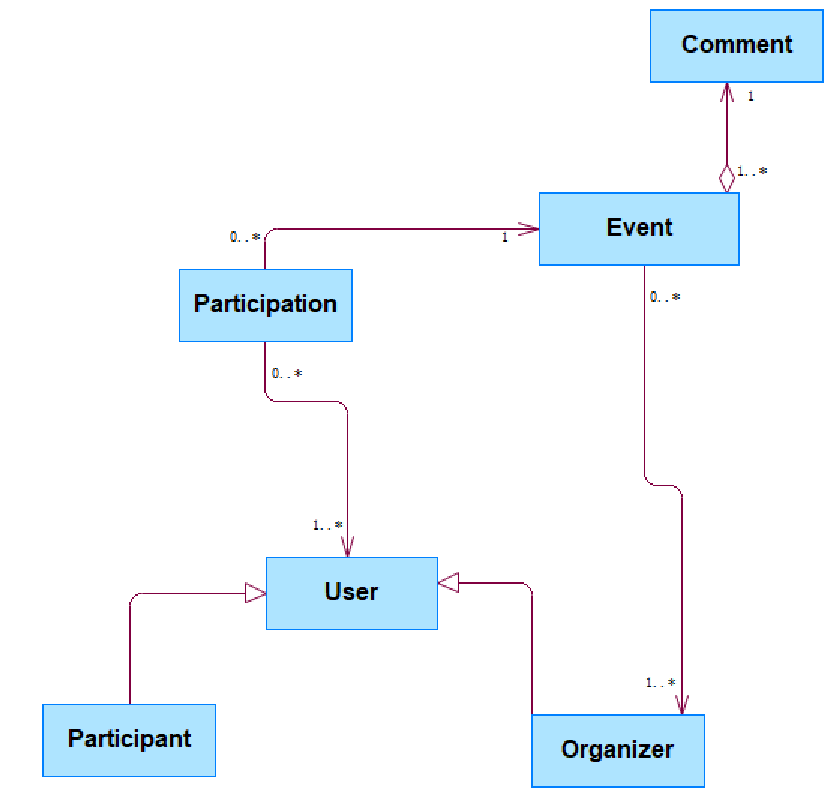
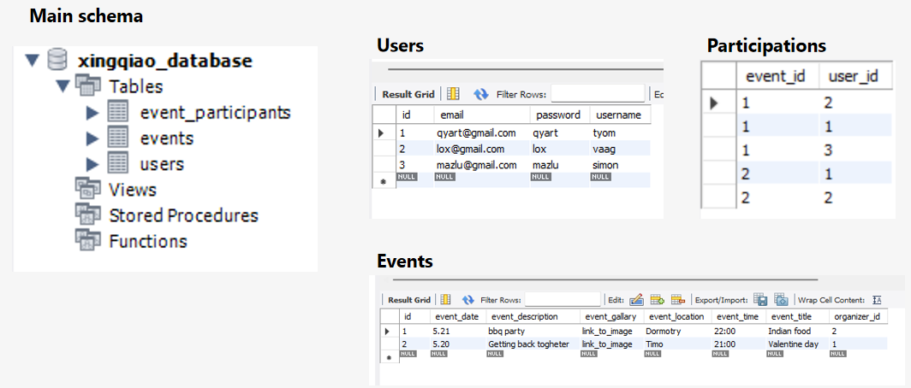

# SJTU Software Principles Project - XingQiao Event Management Platform

## Overview

This repository contains the group project for the "Software Engineering Principles and Practice" course at Shanghai Jiao Tong University (SJTU). The project, titled "XingQiao Event Management Platform", is a comprehensive solution designed to centralize event creation and promotion for students, teachers, and organizations within the campus. It was developed by Vahagn Ghazaryan and Simon Krkyasharyan, employing a wide range of programming languages and tools.

## Course Topics Covered

- Software Process
- Software Engineering Models and Methods
- Software Requirements
- Software Architecture Design
- Software Design Patterns
- User Interface Design
- Coding and Version Management
- Software Testing

## Project Stages

The project development is organized into three main stages, each represented in its respective folder:

- `UIPrototype`: Contains the initial user interface prototypes.
- `TechPrototype`: Technical prototypes showcasing early stage back-end and front-end implementations.
- `FinalRelease`: The final version of the project, including all functionalities and polished features.

## Platform Details

### Purpose

**Why**: The platform addresses the need for a centralized system where students can easily create and promote events on campus.

**How**: By integrating key event planning tools into one user-friendly platform.

**What**: A centralized platform where students, teachers, and organizations can create, browse, join, and manage academic and social events.

### Use Cases
- User login and account management.
- Browsing and joining events.
- Creating and managing events.
- Cancelling event registration.

### Innovations

- Enables students to create their own events.
- Integrated Email System for event notifications.
- Integrated GPT AI system to assist in event management and planning.

### Architecture and Key Technologies
- **User Interface (Front-end)**: Implemented using React Native for a web application experience.
- **Business Logic (Back-end)**: Developed using Python Flask and Java Spring Boot.
- **Data Access (Database)**: Managed by Spring Boot JPA and MySQL.

## Conceptual Model

## Database Design

## Acknowledgements

Special thanks to the faculty and teaching assistants at SJTU for their guidance and support throughout the course. This project is a testament to the practical application of software engineering principles in a real-world scenario.
